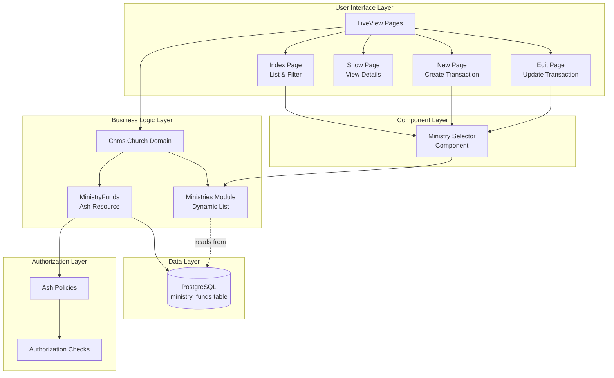
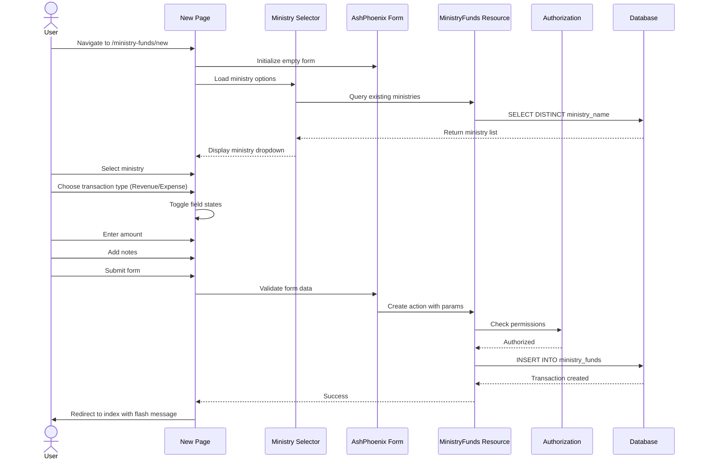
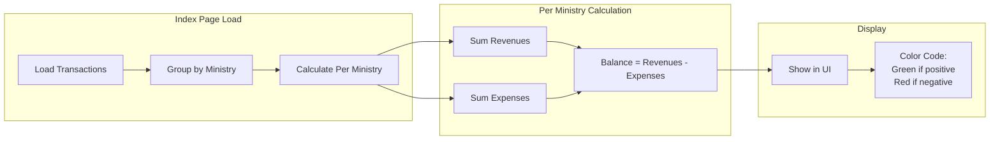
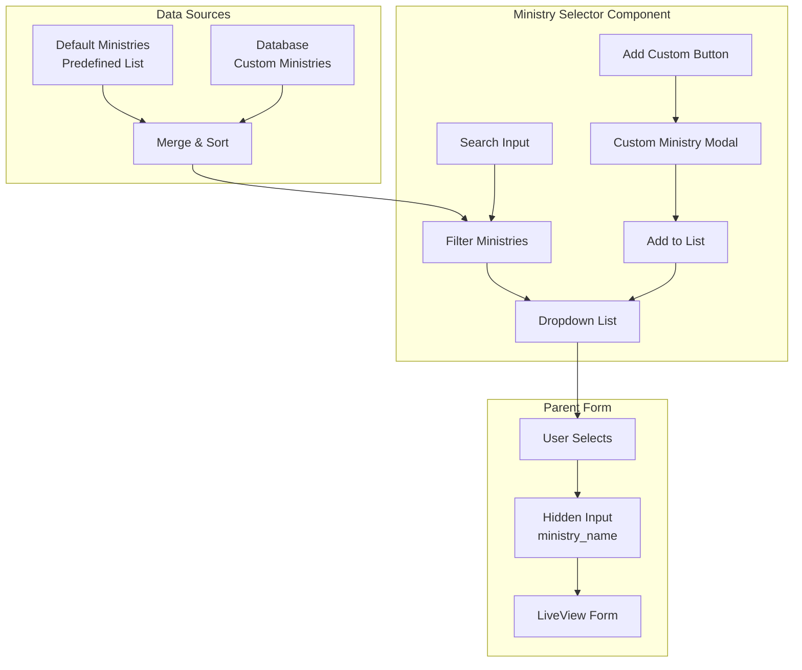
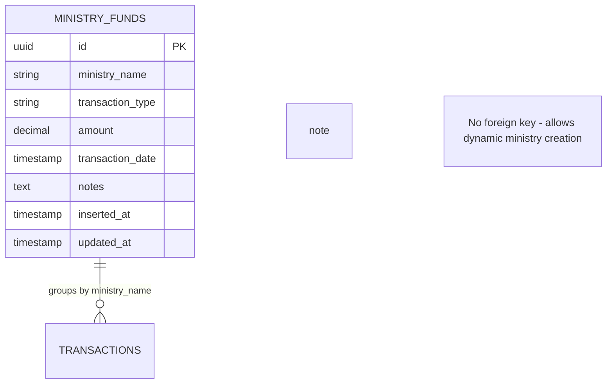
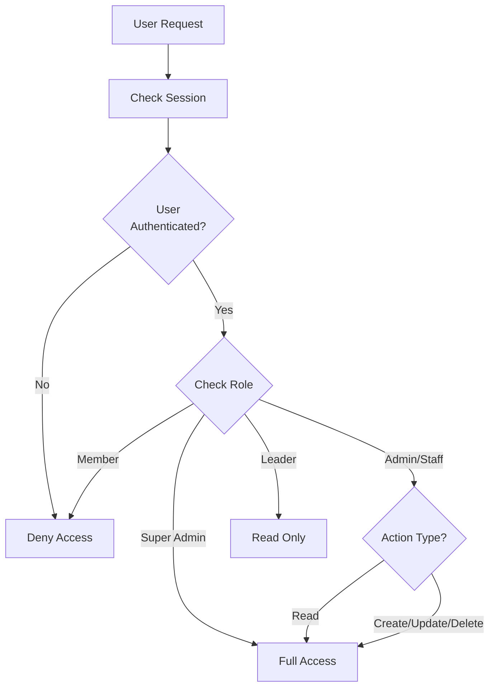
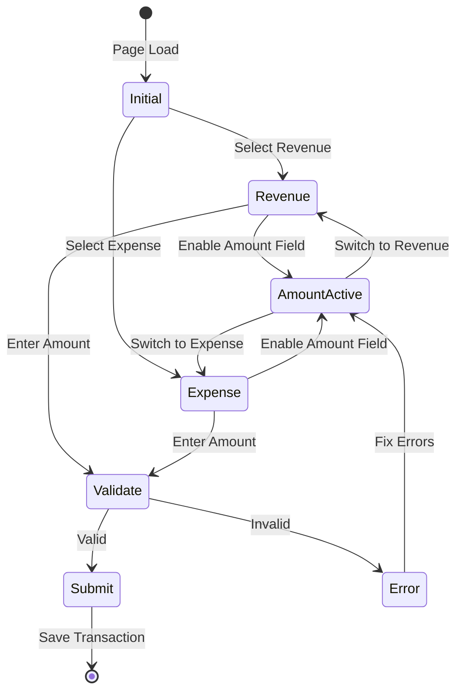

# Ministry Funds - System Architecture

## High-Level Architecture



## Data Flow - Creating a Transaction



## Balance Calculation Flow



## Component Interaction - Ministry Selector



## Database Schema Relationships



## Authorization Flow



## UI State Management - Transaction Type Toggle



## File Organization

```
churchapp/
├── lib/
│   ├── chms/
│   │   └── church/
│   │       ├── congregants.ex
│   │       ├── contributions.ex
│   │       ├── contribution_types.ex
│   │       ├── ministries.ex (UPDATED)
│   │       ├── ministry_funds.ex (NEW)
│   │       └── statistics.ex
│   │
│   └── churchapp_web/
│       ├── components/
│       │   ├── congregant_selector.ex
│       │   ├── contribution_type_selector.ex
│       │   ├── ministry_selector.ex (NEW)
│       │   └── core_components.ex
│       │
│       ├── live/
│       │   ├── congregants/
│       │   ├── contributions/
│       │   ├── dashboard/
│       │   ├── ministry_funds/ (NEW)
│       │   │   ├── index_live.ex
│       │   │   ├── new_live.ex
│       │   │   ├── show_live.ex
│       │   │   └── edit_live.ex
│       │   └── users/
│       │
│       └── router.ex (UPDATED)
│
└── priv/
    └── repo/
        └── migrations/
            └── YYYYMMDDHHMMSS_add_ministry_funds.exs (NEW)
```

## Key Design Patterns

### 1. Transaction Type Pattern
- **Single Amount Field**: Store positive values only
- **Type Discriminator**: Use `transaction_type` enum
- **UI Toggle**: Radio buttons or toggle switch
- **Validation**: Ensure only one type per transaction

### 2. Dynamic List Pattern (Like Contribution Types)
- **Default Values**: Predefined ministry list
- **Database Query**: Fetch custom ministries
- **Merge & Sort**: Combine both sources
- **Searchable Dropdown**: LiveComponent with filtering

### 3. Balance Calculation Pattern
- **Aggregate on Read**: Calculate when displaying
- **Group by Ministry**: Organize transactions
- **Sum by Type**: Separate revenue and expense totals
- **Subtract**: Balance = Revenues - Expenses

### 4. Form Validation Pattern
- **Client-Side**: LiveView phx-change events
- **Server-Side**: Ash resource constraints
- **Real-Time Feedback**: Update UI immediately
- **Error Display**: Show validation errors inline

## Performance Considerations

### Indexing Strategy
```sql
-- Primary queries
CREATE INDEX idx_ministry_funds_ministry_name ON ministry_funds(ministry_name);
CREATE INDEX idx_ministry_funds_transaction_date ON ministry_funds(transaction_date);
CREATE INDEX idx_ministry_funds_transaction_type ON ministry_funds(transaction_type);

-- Composite index for common query pattern
CREATE INDEX idx_ministry_funds_ministry_date 
  ON ministry_funds(ministry_name, transaction_date DESC);
```

### Query Optimization
- Use Ash Query filters for database-level filtering
- Paginate large result sets
- Cache ministry list in LiveView assigns
- Calculate balances in memory after fetching transactions

### LiveView Optimization
- Use streams for large transaction lists
- Debounce search inputs
- Lazy load transaction details
- Cache calculated balances per page load

## Security Considerations

1. **Authorization**: Enforce at resource level with Ash policies
2. **Input Validation**: Sanitize all user inputs
3. **SQL Injection**: Use parameterized queries (Ash handles this)
4. **XSS Prevention**: Phoenix auto-escapes HTML
5. **CSRF Protection**: Phoenix built-in protection
6. **Amount Validation**: Ensure positive values only
7. **Date Validation**: Prevent future dates if needed

## Accessibility Features

1. **Keyboard Navigation**: Full keyboard support in selectors
2. **ARIA Labels**: Proper labels for screen readers
3. **Focus Management**: Logical tab order
4. **Color Contrast**: WCAG AA compliant
5. **Error Announcements**: Screen reader friendly errors
6. **Form Labels**: All inputs properly labeled

## Responsive Design

- **Mobile First**: Design for small screens
- **Breakpoints**: sm, md, lg, xl
- **Touch Targets**: Minimum 44x44px
- **Horizontal Scroll**: Prevent on mobile
- **Collapsible Filters**: Hide on mobile by default
- **Stacked Layout**: Single column on mobile

## Testing Strategy

### Unit Tests
- Balance calculation logic
- Ministry list merging
- Transaction type validation
- Amount constraints

### Integration Tests
- CRUD operations
- Authorization checks
- Database constraints
- Query performance

### LiveView Tests
- Form submission
- Field toggling
- Search/filter
- Pagination
- Bulk operations

### E2E Tests
- Complete user flows
- Multi-user scenarios
- Error handling
- Edge cases